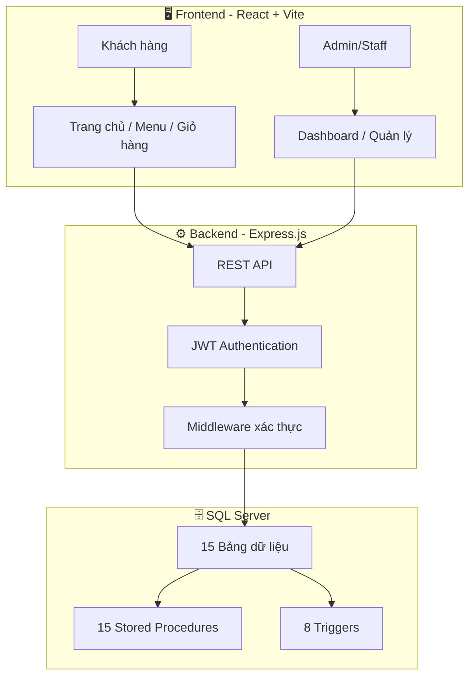
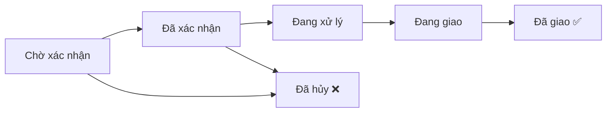

# ☕ Highlands Coffee - Hệ Thống Quản Lý Bán Hàng Trực Tuyến

<p align="center">
  <strong>Highland Coffee's Online Sales Management System</strong><br/>
  Hệ thống quản lý bán hàng trực tuyến cho chuỗi cà phê Highlands Coffee
</p>

---

## 📋 Giới Thiệu

Đây là hệ thống **quản lý bán hàng trực tuyến** hoàn chỉnh dành cho thương hiệu **Highlands Coffee**, được xây dựng theo kiến trúc **Client-Server** với 3 tầng: **Frontend (React)**, **Backend (Node.js/Express)**, và **Database (SQL Server)**.

Hệ thống cung cấp trải nghiệm mua sắm trực tuyến cho khách hàng, đồng thời hỗ trợ nhân viên và quản lý trong việc xử lý đơn hàng, quản lý sản phẩm, nhập kho và theo dõi doanh thu.

---

## 🏗️ Kiến Trúc Hệ Thống

```
test-web/
├── frontend/          # Giao diện người dùng (React + Vite)
├── backend/           # API Server (Node.js + Express)
├── database/          # Scripts SQL Server (Schema, Seed, SP, Triggers)
└── README.md
```

### Sơ đồ kiến trúc



---

## ✨ Tính Năng Chính

### 🛒 Dành cho Khách Hàng
| Tính năng | Mô tả |
|-----------|-------|
| **Trang chủ** | Hiển thị sản phẩm nổi bật, banner khuyến mãi |
| **Menu sản phẩm** | Duyệt theo danh mục, tìm kiếm sản phẩm |
| **Chi tiết sản phẩm** | Xem mô tả, giá, hình ảnh sản phẩm |
| **Giỏ hàng** | Thêm/xóa/cập nhật số lượng sản phẩm |
| **Thanh toán** | Checkout với nhiều phương thức thanh toán (Tiền mặt, Chuyển khoản, Thẻ, Ví điện tử) |
| **Lịch sử đơn hàng** | Theo dõi trạng thái đơn hàng |
| **Quản lý tài khoản** | Đăng ký, đăng nhập, quên mật khẩu, cập nhật hồ sơ |
| **Điểm tích lũy** | Tự động tích điểm khi đơn hàng giao thành công |
| **Khuyến mãi** | Áp dụng mã giảm giá khi thanh toán |

### 👨‍💼 Dành cho Admin / Staff
| Tính năng | Mô tả |
|-----------|-------|
| **Dashboard** | Thống kê tổng quan (doanh thu, đơn hàng, sản phẩm, khách hàng) |
| **Quản lý sản phẩm** | Thêm/sửa/xóa sản phẩm theo danh mục |
| **Quản lý đơn hàng** | Xử lý đơn hàng theo quy trình 5 bước |
| **Chi tiết đơn hàng** | Xem chi tiết và in hóa đơn |
| **Quản lý kho** | Tạo/duyệt phiếu nhập kho nguyên vật liệu |
| **Báo cáo doanh thu** | Thống kê doanh thu theo khoảng thời gian |
| **Phân quyền** | Admin (Quản lý) có toàn quyền, Staff chỉ xử lý đơn hàng |

### 📦 Quy Trình Xử Lý Đơn Hàng



---

## 🛠️ Công Nghệ Sử Dụng

### Frontend
| Công nghệ | Phiên bản | Vai trò |
|-----------|-----------|---------|
| **React** | 19.x | Thư viện giao diện UI |
| **Vite** | 8.x | Build tool & Dev server |
| **React Router DOM** | 7.x | Điều hướng SPA |
| **Tailwind CSS** | 4.x | CSS framework |
| **Axios** | 1.x | HTTP client |
| **Recharts** | 3.x | Biểu đồ thống kê |
| **Lucide React** | 1.x | Bộ icon |

### Backend
| Công nghệ | Phiên bản | Vai trò |
|-----------|-----------|---------|
| **Node.js** | — | Runtime JavaScript |
| **Express** | 4.x | Web framework |
| **MSSQL** | 11.x | SQL Server driver |
| **JWT** | 9.x | Xác thực token |
| **bcryptjs** | 2.x | Mã hóa mật khẩu |
| **CORS** | 2.x | Cross-Origin |
| **dotenv** | 16.x | Biến môi trường |

### Database
| Công nghệ | Vai trò |
|-----------|---------|
| **SQL Server** | Hệ quản trị CSDL |
| **T-SQL** | Stored Procedures, Triggers |

---

## 🗄️ Cơ Sở Dữ Liệu

### Danh sách 15 bảng

| STT | Tên bảng | Mô tả |
|-----|----------|-------|
| 1 | `DanhMucSanPham` | Danh mục phân loại sản phẩm |
| 2 | `SanPham` | Thông tin sản phẩm (tên, giá, hình ảnh, trạng thái) |
| 3 | `NguyenVatLieu` | Nguyên vật liệu cho sản xuất |
| 4 | `CongThuc` | Công thức liên kết sản phẩm – nguyên vật liệu |
| 5 | `TaiKhoan` | Tài khoản đăng nhập (admin, staff, customer) |
| 6 | `NhanVien` | Thông tin nhân viên (bán hàng, CSKH, giao hàng, quản lý) |
| 7 | `KhachHang` | Thông tin khách hàng và điểm tích lũy |
| 8 | `KhuyenMai` | Chương trình khuyến mãi giảm giá |
| 9 | `GioHang` | Giỏ hàng của khách hàng |
| 10 | `ChiTietGioHang` | Sản phẩm trong giỏ hàng |
| 11 | `DonHang` | Đơn đặt hàng |
| 12 | `ChiTietDonHang` | Chi tiết sản phẩm trong đơn hàng |
| 13 | `HoaDon` | Hóa đơn thanh toán (bao gồm VAT) |
| 14 | `PhieuNhapKho` | Phiếu nhập kho nguyên vật liệu |
| 15 | `ChiTietPhieuNhap` | Chi tiết nguyên vật liệu nhập kho |

### 15 Stored Procedures

| STT | Tên SP | Chức năng |
|-----|--------|-----------|
| 1 | `sp_LaySanPham` | Lấy sản phẩm theo danh mục/tìm kiếm |
| 2 | `sp_ChiTietDonHang` | Xem chi tiết đơn hàng |
| 3 | `sp_ThongKe` | Thống kê Dashboard (doanh thu, đơn hàng) |
| 4 | `sp_TaoDonHang` | Tạo đơn hàng mới |
| 5 | `sp_CapNhatTrangThai` | Cập nhật trạng thái đơn hàng |
| 6 | `sp_BaoCaoDoanhThu` | Báo cáo doanh thu theo thời gian |
| 7 | `sp_LayGioHang` | Lấy giỏ hàng của khách |
| 8 | `sp_ThemVaoGioHang` | Thêm sản phẩm vào giỏ hàng |
| 9 | `sp_CapNhatSoLuongGio` | Cập nhật số lượng trong giỏ |
| 10 | `sp_XoaKhoiGioHang` | Xóa sản phẩm khỏi giỏ |
| 11 | `sp_TaoDonHangTuGioHang` | Checkout — tạo đơn từ giỏ hàng |
| 12 | `sp_XoaGioHang` | Xóa toàn bộ giỏ hàng |
| 13 | `sp_TaoHoaDon` | Tạo hóa đơn từ đơn hàng |
| 14 | `sp_TaoPhieuNhapKho` | Tạo phiếu nhập kho |
| 15 | `sp_LayKhuyenMaiHoatDong` | Lấy khuyến mãi đang hoạt động |

### 8 Triggers

| STT | Tên Trigger | Chức năng |
|-----|-------------|-----------|
| 1 | `trg_ChiTietDonHang_TinhThanhTien` | Tự động tính `ThanhTien = SoLuong × DonGia` |
| 2 | `trg_ChiTietDonHang_CapNhatTongTien` | Tự động cập nhật `TongTien` đơn hàng |
| 3 | `trg_ChiTietGioHang_CapNhatTongTien` | Tự động cập nhật `TongTienTam` giỏ hàng |
| 4 | `trg_DonHang_CapNhatDiemTichLuy` | Tích điểm khi đơn giao thành công (10.000đ = 1 điểm) |
| 5 | `trg_PhieuNhapKho_CapNhatTonKho` | Cập nhật tồn kho khi phiếu nhập được duyệt |
| 6 | `trg_ChiTietGioHang_KiemTraSanPham` | Kiểm tra sản phẩm đang bán trước khi thêm giỏ |
| 7 | `trg_DonHang_KiemTraHuyDon` | Không cho hủy đơn hàng đã giao |
| 8 | `trg_ChiTietPhieuNhap_TinhThanhTien` | Tự động tính thành tiền phiếu nhập |

---

## 🔌 API Endpoints

### Authentication (`/api/auth`)
| Method | Endpoint | Mô tả |
|--------|----------|-------|
| `POST` | `/api/auth/register` | Đăng ký tài khoản |
| `POST` | `/api/auth/login` | Đăng nhập |
| `POST` | `/api/auth/forgot-password` | Quên mật khẩu |

### Products (`/api/products`)
| Method | Endpoint | Mô tả |
|--------|----------|-------|
| `GET` | `/api/products` | Lấy danh sách sản phẩm |
| `GET` | `/api/products/:id` | Chi tiết sản phẩm |
| `POST` | `/api/products` | Thêm sản phẩm (Admin) |
| `PUT` | `/api/products/:id` | Cập nhật sản phẩm (Admin) |
| `DELETE` | `/api/products/:id` | Xóa sản phẩm (Admin) |

### Categories (`/api/categories`)
| Method | Endpoint | Mô tả |
|--------|----------|-------|
| `GET` | `/api/categories` | Lấy danh sách danh mục |

### Orders (`/api/orders`)
| Method | Endpoint | Mô tả |
|--------|----------|-------|
| `GET` | `/api/orders` | Danh sách đơn hàng |
| `GET` | `/api/orders/:id` | Chi tiết đơn hàng |
| `POST` | `/api/orders` | Tạo đơn hàng |
| `PUT` | `/api/orders/:id/status` | Cập nhật trạng thái |

### Promotions (`/api/promotions`)
| Method | Endpoint | Mô tả |
|--------|----------|-------|
| `GET` | `/api/promotions` | Lấy khuyến mãi đang hoạt động |

### Profile (`/api/profile`)
| Method | Endpoint | Mô tả |
|--------|----------|-------|
| `GET` | `/api/profile` | Lấy thông tin cá nhân |
| `PUT` | `/api/profile` | Cập nhật hồ sơ |

### Warehouse (`/api/warehouse`)
| Method | Endpoint | Mô tả |
|--------|----------|-------|
| `GET` | `/api/warehouse` | Danh sách phiếu nhập kho |
| `POST` | `/api/warehouse` | Tạo phiếu nhập kho |
| `PUT` | `/api/warehouse/:id` | Cập nhật trạng thái phiếu nhập |

---

## 🚀 Hướng Dẫn Cài Đặt

### Yêu Cầu Hệ Thống

- **Node.js** ≥ 18.x
- **SQL Server** (MSSQL) — khuyến nghị SQL Server 2019+
- **SQL Server Management Studio (SSMS)** — để chạy scripts database
- **Git** (tùy chọn)

### Bước 1: Clone Repository

```bash
git clone https://github.com/PhanCaoToan/Highland-Coffee-s-online-sales-management-system.git
cd Highland-Coffee-s-online-sales-management-system
```

### Bước 2: Thiết Lập Database

Mở **SQL Server Management Studio (SSMS)** và chạy các file SQL theo thứ tự:

```
1. database/0_setup.sql              → Tạo database & user
2. database/schema.sql               → Tạo 15 bảng
3. database/seed_data.sql            → Dữ liệu mẫu
4. database/stored_procedures.sql    → 15 stored procedures
5. database/triggers.sql             → 8 triggers
6. database/seed_promotions.sql      → Dữ liệu khuyến mãi
7. database/update_images.sql        → Cập nhật đường dẫn hình ảnh
```

### Bước 3: Cấu Hình Backend

```bash
cd backend
```

Tạo hoặc chỉnh sửa file `.env`:

```env
PORT=5000
JWT_SECRET=your_secret_key_here
DB_SERVER=YOUR_SERVER_NAME
DB_NAME=HighlandsCoffeeDB
DB_USER=sa
DB_PASSWORD=your_password
DB_PORT=1433
```

Cài đặt dependencies và chạy server:

```bash
npm install
npm run dev
```

> Server sẽ chạy tại: `http://localhost:5000`

### Bước 4: Cấu Hình Frontend

```bash
cd frontend
npm install
npm run dev
```

> Frontend sẽ chạy tại: `http://localhost:5173`

---

## 👥 Phân Quyền Hệ Thống

| Vai trò | Quyền hạn |
|---------|-----------|
| **Admin** (Quản lý) | Toàn quyền: Dashboard, sản phẩm, đơn hàng, kho, báo cáo doanh thu |
| **Staff** (Nhân viên) | Xử lý đơn hàng, quản lý kho |
| **Customer** (Khách hàng) | Xem sản phẩm, đặt hàng, quản lý tài khoản |

---

## 📂 Cấu Trúc Chi Tiết

```
frontend/src/
├── components/
│   ├── Navbar.jsx              # Thanh điều hướng chính
│   ├── Footer.jsx              # Chân trang
│   ├── CartDrawer.jsx          # Sidebar giỏ hàng
│   ├── ProductCard.jsx         # Card hiển thị sản phẩm
│   └── ProtectedRoute.jsx      # Route bảo vệ (xác thực)
├── context/
│   ├── AuthContext.jsx         # Quản lý trạng thái xác thực
│   └── CartContext.jsx         # Quản lý trạng thái giỏ hàng
├── pages/
│   ├── Home.jsx                # Trang chủ
│   ├── Menu.jsx                # Danh sách sản phẩm
│   ├── ProductDetail.jsx       # Chi tiết sản phẩm
│   ├── Cart.jsx                # Giỏ hàng
│   ├── Checkout.jsx            # Thanh toán
│   ├── Login.jsx               # Đăng nhập
│   ├── Register.jsx            # Đăng ký
│   ├── ForgotPassword.jsx      # Quên mật khẩu
│   ├── OrderHistory.jsx        # Lịch sử đơn hàng
│   ├── Profile.jsx             # Hồ sơ cá nhân
│   └── admin/
│       ├── AdminLayout.jsx     # Layout trang admin (sidebar)
│       ├── Dashboard.jsx       # Tổng quan thống kê
│       ├── ManageProducts.jsx  # Quản lý sản phẩm
│       ├── ManageOrders.jsx    # Quản lý đơn hàng
│       ├── StaffOrderDetail.jsx # Chi tiết đơn hàng (in hóa đơn)
│       ├── ManageWarehouse.jsx # Quản lý kho
│       ├── WarehouseDetail.jsx # Chi tiết phiếu nhập kho
│       └── RevenueReport.jsx   # Báo cáo doanh thu
├── services/                   # Axios API services
├── App.jsx                     # Routing chính
├── main.jsx                    # Entry point
└── index.css                   # Global styles

backend/
├── config/
│   └── db.js                   # Kết nối SQL Server (mssql)
├── middleware/
│   └── auth.js                 # JWT authentication middleware
├── routes/
│   ├── auth.js                 # Routes xác thực
│   ├── categories.js           # Routes danh mục
│   ├── products.js             # Routes sản phẩm
│   ├── orders.js               # Routes đơn hàng
│   ├── promotions.js           # Routes khuyến mãi
│   ├── profile.js              # Routes hồ sơ
│   └── warehouse.js            # Routes nhập kho
├── server.js                   # Entry point
├── migrate.js                  # Migration script
├── seed.js                     # Seeding script
└── .env                        # Biến môi trường

database/
├── 0_setup.sql                 # Tạo database & cấu hình ban đầu
├── schema.sql                  # Schema 15 bảng + indexes
├── seed_data.sql               # Dữ liệu mẫu
├── stored_procedures.sql       # 15 Stored Procedures
├── triggers.sql                # 8 Triggers
├── seed_promotions.sql         # Dữ liệu khuyến mãi
├── fix_passwords.sql           # Script sửa mật khẩu
├── migration_update_status.sql # Migration cập nhật trạng thái
└── update_images.sql           # Cập nhật hình ảnh sản phẩm
```

---

## 🔒 Bảo Mật

- **JWT Token** — Xác thực người dùng qua JSON Web Token
- **bcrypt** — Mã hóa mật khẩu một chiều
- **Middleware** — Kiểm tra quyền truy cập cho các route admin/staff
- **SQL Parameterized Queries** — Chống SQL Injection
- **CORS** — Kiểm soát truy cập từ các origin khác nhau

---

## 👤 Tác Giả

- **Phan Cao Toàn** — MSSV: 8804
- Đồ án môn **Hệ Điều Tra** (HĐT)

---

## 📄 License

Dự án này được phát triển phục vụ mục đích học tập và nghiên cứu.

---

<p align="center">
  <sub>☕ Built with ❤️ for Highlands Coffee</sub>
</p>
